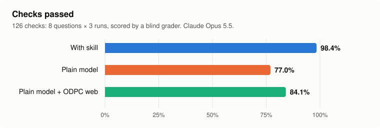
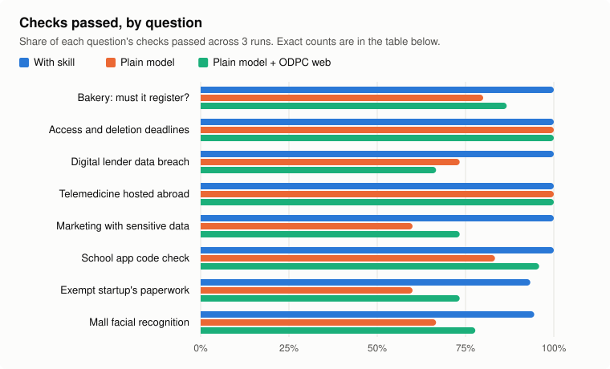

<h1 align="center">Kenya data protection (ODPC) skill</h1>

<p align="center">
  <em>Checks a product, business or codebase against Kenya's Data Protection Act 2019, and says what to fix.</em>
</p>

<p align="center">
  <a href="https://github.com/jaysonmulwa/kenya-data-protection/actions/workflows/test.yml"></a>
  
  
  
</p>

<p align="center">
  <strong>98.4% of legal checks passed, against 77.0% for the same model without it and 84.1% with ODPC web research</strong><br>
  <sub>8 realistic questions × 3 runs, Claude Opus 5.5, scored by a blind grader. <a href="#eval-results">Details</a>.</sub>
</p>

It tells you:

- whether you must register with the ODPC as a data controller or processor, and the fee;
- what your privacy notice, published policy, consent, sensitive data, children's data, marketing, retention, processor contracts, transfers abroad, impact assessments and breach plan are missing;
- what to do next, and what to ask the ODPC or a lawyer.

It works from the official texts, with section numbers: the Act, and the Registration and General Regulations 2021, as revised to 31 December 2022. Check for later changes before relying on a figure. **It is not legal advice.**

## Install

**Claude Code** (tested end to end):

```
/plugin marketplace add jaysonmulwa/kenya-data-protection
```
```
/plugin install kenya-data-protection@kenya-data-protection-marketplace
```

Send them as two separate prompts. Claude then uses it whenever a request matches, or run it directly with `/kenya-data-protection:kenya-data-protection`.

**Every other agent:** see [INSTALL.md](INSTALL.md). It is packaged for Codex, GitHub Copilot CLI, Gemini CLI, Qwen Code, Antigravity, Pi, Kimi Code, Devin, Grok Build, Hermes, Qoder, Goose, OpenClaw, OpenCode and the Skills CLI, and as a rules file for Cursor, Windsurf, Cline, Kiro, Copilot Chat, Aider, Zed, Amp, Jules and Junie. Plugin hosts get the full skill; rules-file hosts get [`AGENTS.md`](AGENTS.md), a compact version with every key rule, figure and deadline.

## Use

Ask in your own words, for example:

- "Do we need to register with the Data Commissioner? We're three people with about KES 2M revenue, and we take payments by M-Pesa."
- "Check this repo's privacy notice and data model against Kenya's Data Protection Act."
- "We had a breach of user phone numbers and passwords last night. What do we owe the ODPC?"

It replies with a verdict, a table of gaps with the section of the law for each, and next steps.

For a codebase it first runs a scanner (Python, no dependencies) that lists personal data fields, Kenyan sensitive data, signs of children's data, third-party services, hosting regions and any privacy notice. You can run it yourself:

```
python skills/kenya-data-protection/scripts/scan_repo.py path/to/your/repo
```

## Eval results

Eight realistic questions, each answered 3 times by Claude Opus 5.5 in three setups: with the skill, the plain model, and the plain model told to research the ODPC website first. A blind grader scored every answer against 42 fixed checks taken from the official texts. Run on 2026-10-06 and 2026-10-07, with the with-skill answers from the version in this repo.

<picture>
  <source media="(prefers-color-scheme: dark)" srcset="assets/eval-overall-dark.svg">
  
</picture>

<picture>
  <source media="(prefers-color-scheme: dark)" srcset="assets/eval-by-question-dark.svg">
  
</picture>

| | With skill | Plain model | Plain model + ODPC web research |
|---|---|---|---|
| **Checks passed (of 126)** | **124 (98.4%)** | 97 (77.0%) | 106 (84.1%) |
| Per-run pass rate, mean ± sd | 98.5% ± 5.2% | 77.9% ± 16.9% | 84.2% ± 14.8% |
| Average time per answer | 52 s | 42 s | 122 s |
| Average cost per answer | $0.28 | $0.13 | $0.97 |
| Extra legal errors flagged by the grader* | 11 | 17 | 14 |

\* Wrong claims the 42 checks don't cover. I checked the 11 with-skill flags against the official texts: 2 were the grader's own mistakes, and the rest are small slips in single answers. The other setups' flags weren't checked.

| Question | With skill | Plain model | Plain + ODPC web |
|---|---|---|---|
| Bakery, 12 staff, KES 3.2M: must it register? | 15/15 | 12/15 | 13/15 |
| Deadlines for access and deletion requests | 12/12 | 12/12 | 12/12 |
| Digital lender data breach | 15/15 | 11/15 | 10/15 |
| Telemedicine app hosted in Ireland | 12/12 | 12/12 | 12/12 |
| Wedding client list used for marketing | 15/15 | 9/15 | 11/15 |
| School parent app code check | 24/24 | 20/24 | 23/24 |
| Exempt startup: any paperwork needed? | 14/15 | 9/15 | 11/15 |
| Mall adding facial recognition to CCTV | 17/18 | 12/18 | 14/18 |

**Checks the plain model failed in all 3 runs:**
- the Act's duties apply even if you don't have to register;
- no sensitive data in direct marketing, even with consent (reg 15(1));
- 7 days to stop sharing data with third parties for their marketing (reg 18);
- everyone must publish a data protection policy (reg 23);
- a mall's security CCTV makes registration mandatory.

With ODPC web research, the model still failed the reg 18 and reg 23 checks in all 3 runs, and reg 37's breach tests in all 3 runs. The plain model is as good as the skill on headline rules: the 72 hours, request deadlines, the fine cap, local hosting for health care.

The setup, the pass count for every check, and where the skill still falls short are in [evals/RESULTS.md](evals/RESULTS.md).

## What's inside

```
skills/kenya-data-protection/      the skill: the source of truth
├── SKILL.md                       how the check runs, and the report format
├── scripts/scan_repo.py           maps a codebase's personal data, processors and hosting
└── references/
    ├── law.md                     the rules, thresholds, fees and deadlines, with sections
    └── checklists.md              privacy notice, requests, DPIA, breach, transfers, processors
AGENTS.md                          compact rules version, for agents without skills
.claude-plugin/ .codex-plugin/ …   one manifest per plugin host, all pointing at skills/
.cursor/ .windsurf/ .kiro/ …       one rules file per host, generated from AGENTS.md
evals/                             the benchmark: questions, checks, runner and results
```

| Host | Files |
|---|---|
| Claude Code | `.claude-plugin/` |
| Codex | `.codex-plugin/`, `.agents/plugins/marketplace.json` |
| GitHub Copilot CLI | `.github/plugin/` |
| Gemini CLI, Qwen Code, Antigravity | `gemini-extension.json`, `commands/` |
| Devin | `.devin-plugin/` |
| Grok Build | `.grok-plugin/`, `skills/plugin.json` |
| Kimi Code | `.kimi-plugin/` |
| Qoder | `.qoder-plugin/`, `.qoder/rules/` |
| Hermes Agent | `plugin.yaml`, `__init__.py`, `after-install.md` |
| Pi | `package.json` |
| OpenClaw | `.openclaw/skills/` (generated copy of the skill) |
| OpenCode | `AGENTS.md`, `.opencode/command/` |
| Cursor, Windsurf, Cline, Kiro, Antigravity, Copilot Chat | `.cursor/rules/`, `.windsurf/rules/`, `.clinerules/`, `.kiro/steering/`, `.agents/rules/`, `.github/copilot-instructions.md` |

## Changing the skill

Edit `skills/kenya-data-protection/` and `AGENTS.md`, then regenerate the per-host copies and check them:

```
python scripts/sync_harness_files.py
python tests/test_scan_repo.py
```

CI fails if a copy drifts or a manifest's version doesn't match. After a benchmark run (`evals/run_skill_benchmark.py`), copy its `results.json` to `evals/` and redraw the charts with `python scripts/render_eval_charts.py`.

## Sources

- [Data Protection Act 2019](https://new.kenyalaw.org/akn/ke/act/2019/24/eng@2022-12-31)
- [Registration of Data Controllers and Data Processors Regulations 2021](https://new.kenyalaw.org/akn/ke/act/ln/2021/265/eng@2022-12-31)
- [Data Protection (General) Regulations 2021](https://new.kenyalaw.org/akn/ke/act/ln/2021/263/eng@2022-12-31)
- [Office of the Data Protection Commissioner](https://www.odpc.go.ke)

## License

MIT. See [LICENSE](LICENSE).
